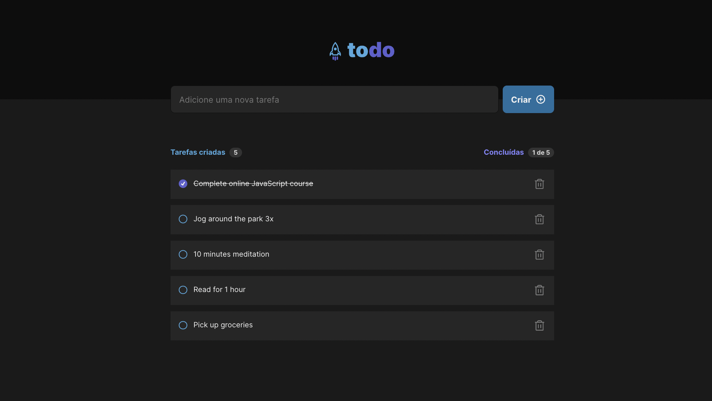

## Como executar

Primeiro, execute o servidor de desenvolvimento:

```bash
npm run dev
# ou
yarn dev
```

Acesse [http://localhost:5174/](http://localhost:5174/) no seu navegador para ver o resultado.

## Objetivo

Desenvolver uma aplicação de controle de tarefas no estilo **to-do list**, que contém as seguintes funcionalidades:

- Adicionar uma nova tarefa
- Marcar e desmarcar uma tarefa como concluída
- Remover uma tarefa da listagem
- Mostrar o progresso de conclusão das tarefas 

## Requisitos Técnicos

Apesar de serem poucas funcionalidades, é necessário recordar conceitos como:
- Estados
- Imutabilidade do estado
- Listas e chaves no ReactJS
- Propriedades
- Componentização
